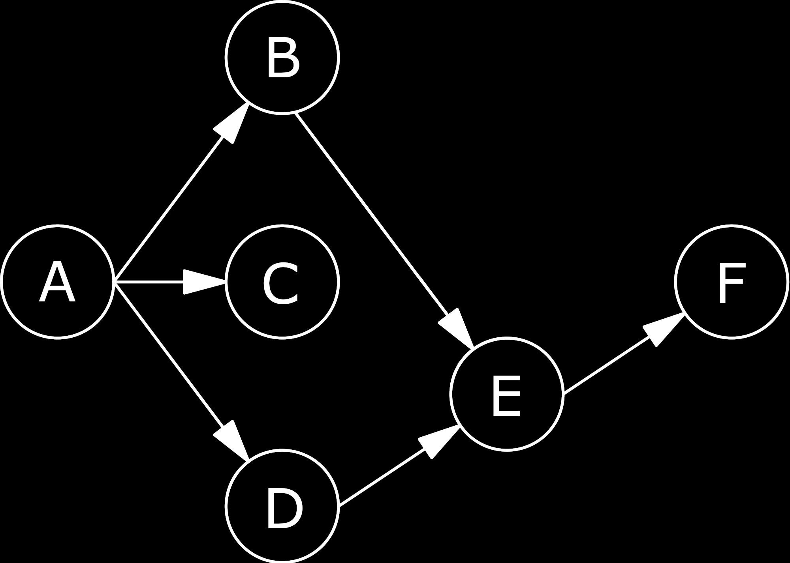

theme: DLNext

# iOS Dependency Injection (DI)

---

# Workshop outline

- Theory talk (~45 minutes).
- Break.
- Guided app refactor (~ 2 hours).
- Wrap-up (5 minutes).

---

# Goals

- **Understanding** of DI principles and benefits.
- **Experience** adding manual DI to MVC/MVVM.
- **Awareness** of the costs/benefits of DI frameworks.

_I want this workshop to change how you write code._

---

# Talk

---

# What is a dependency?

When a class `C` uses functionality from a type `D` _to perform its own functions_, then `D` is called a **dependency** of `C`.

`C` is called a **consumer** of `D`.

^We also use the word dependency to mean "a third party library that our app consumes". The two usages describe the same concept applied at different scales (single class vs entire application).

---

# Why do we use dependencies?

- To share logic and keep our code **DRY**.
- To model logical abstractions, **minimizing cognitive load**.

^Creating/using/maintaining dependencies is a good and natural part of developing well-organized, maintainable software. We want to keep using them while minimizing the drawbacks that we'll uncover shortly.

---

# Consumer/dependency example

[.code-highlight: all]
[.code-highlight: 1-2]
[.code-highlight: 3]
[.code-highlight: 4-5]

```swift
class FriendlyTime {
   // ^^^^^^^^^^^^ Consumer
  func timeOfDay() -> String {
    switch Calendar.current.dateComponents([.hour], from: Date()).hour! {
        // ^^^^^^^^^^^^^^^^         Dependencies          ^^^^^^
    case 6...12:  return "Morning"
    case 13...17: return "Afternoon"
    case 18...21: return "Evening"
    default:      return "Night"
    }
  }
}
```

^In this example, the `FriendlyTime` class is a consumer. Its capabilities include providing collaborators with a human-readable time of day. In order to select the appropriate string, the `FriendlyTime` class uses functionality from `Calendar` and `Date` instances to fetch the current hour. The `Calendar` and `Date` instances are therefore dependencies of `FriendlyTime`.

---

# iOS consumers

In iOS, **important consumers** include:

- view controllers,
- _view models._

These classes are the hearts of our apps. Their capabilities include transforming app state into UI state, processing user input, coordinating network requests, and applying business rules. **Testing them is valuable!**

^These are not the only consumers you'll find in iOS apps, and they're not the only consumers worth testing. But they usually house significant amounts of application logic and so are some of the first classes to consider testing.

^Unit testing view controllers will be hard even if you add DI, because they are tightly coupled to iOS types and lifecycles. For this reason, I would normally prioritize refactoring to use view models before thinking about adding DI. We'll do this in the guided refactor later.

---

# Getting to testing

- **First**: make consumers (unit) testable (_via DI_).
- **Then**: add unit tests.

^An alternative strategy is: first, add the best tests you can around existing hard-to-test code, then make that code (and all new code) testable. This better protects against regressions but requires already-strong testing skills and the ability to use anti-patterns extensively without forming bad habits.

---

# iOS dependencies

In iOS, **common dependencies** include:

- API clients,
- local storage,
- clocks,
- geocoders,
- user sessions.

^A lot of these examples depend on "external resources" (e.g. network connectivity; device hardware; system timezone settings). Such dependencies are impure/volatile (since their behavior may vary over time), which makes it especially important that we figure out how to replace them with mocks that behave predictably for unit tests. More on this later.

---

# iOS consumer/dependency examples

[.build-lists: true]

- A login **view controller** that uses an _API client_ to submit user credentials to a backend.
- A choose sandwich **view model** that uses _local storage_ to track the last sandwich ordered.
- A choose credit card **view model** that uses a _clock_ to determine which cards are expired.

---

# Dependency dependencies

Some classes are **both** consumers and dependencies.
<br />
Example: an API client may consume local storage (for caching) **and** be consumed by view models.
<br />
We can model all these dependency relationships using a **dependency graph**.

^We're not going to discuss dependency graphs in any great detail, but the concept crops up when we touch on DI frameworks later, so it's good to be aware of.

---

# Dependency graph example



^A visual representation of an example dependency graph. Some example relationships: A is a consumer of B, C, and D. B and D are both consumers (of E) and dependencies (of A). F is a dependency of E.

---

# Mommy, where do dependencies come from?

[.build-lists: true]

- _Consumers_ locate their own dependencies (**hard-coded**).
- _Consumers_ ask an external class for their dependencies (**service locator**).
- _An external class_ injects a consumer's dependencies via initializers or property mutation (**dependency injection**).

^By default, most folks writing untested code will hard-code their dependencies and feel little to no pain.

^DI vs SL is not super important for our purposes.

---

# Hard-coded dependencies

[.code-highlight: all]
[.code-highlight: 3-4]

```swift
class FriendlyTime {
  func timeOfDay() -> String {
    switch Calendar.current.dateComponents([.hour], from: Date()).hour! {
        // ^^^^^^^^^^^^^^^^    Hard-coded dependencies    ^^^^^^
    case 6...12:  return "Morning"
    case 13...17: return "Afternoon"
    case 18...21: return "Evening"
    default:      return "Night"
    }
  }
}
```

(Be mindful of dependencies added by protocol conformance)

^The use of an initializer can signal a hard-coded dependency. Note that some non-dependency "glue" code (e.g. lists used for temporary storage) will also be instantiated using initializers, so more thought is required to determine whether the instantiated object plays a significant role in the functionality of the consumer or not. This is a bit of an art.

^Accessing a static or singleton instance directly is also considered to be hard-coding.

^It doesn't matter _where_ a consumer accesses a hard-coded dependency; whether up front (in its own initializer) or on-demand (e.g. in a method body, as in this example) - it's hard-coding either way.

---

# Hard-coding hardships

A consumer with _volatile_ dependencies will be **very hard to unit test at all**:
<br />

```swift
func testTimeOfDayMorning() {
  let expected = "Morning"
  let actual = FriendlyTime().timeOfDay()
  // Fails ~70% of the time:
  XCTAssertEqual(expected, actual)
}
```

^Users of the `FriendlyTime` class have no way of testing the `timeOfDay` logic independently of the real date and time. This means writing a reliable unit test for `timeOfDay` is impossible!

---

# Hard-coding hardships

A consumer that hard-codes access to _singletons_ may have **brittle/slow/lying unit tests** (if state is accidentally shared between tests).

^This can be worked around in ugly ways, by e.g. manually resetting the states of _all_ singletons in your app in between every unit test, but it's easy to forget to update when you add a new singleton.

---

# Hard-coding hardships

A consumer's dependencies are **hidden**:
<br />

```swift
// Dependencies on Calendar and Date are invisible:
let friendlyTime = FriendlyTime()
print(friendlyTime.timeOfDay())
```

^Users of the `FriendlyTime` class have no way of easily determining which other app classes it uses.

---

# We can do better

<!-- Part 1/2 -->

We will *refactor so that*:

- Consumers demand all dependencies via their **initializers**.
- Consumer initializer parameters are all **protocols**.

^We haven't discussed all the implementation details yet, e.g. who creates the dependencies demanded by each consumer, but these two statements are the essentials of DI!

---

# We can do better

<!-- Part 2/2 -->

We will *refactor so that*:

- Consumers demand all dependencies via their **initializers**.
- Consumer initializer parameters are all **protocols**.

*Outcomes*:

- ✅ Production code can supply **real implementations**.
- ✅ Tests can supply **stable fake implementations**.
- ✅ Consumer dependencies are made visible.

---

# Recipe

<!-- Part 1/6 -->

1. **Create protocols describing _ideal_ dependency behaviors.**

**_Ideal_** is fuzzy, but desirable properties include:

- names based on **_outcomes_**, not implementations,
- **_domain-specific_** names when appropriate,
- a pragmatic balance between **_specificity_** and **_cohesion_**.

^We can identify the relevant behaviors of our existing hard-coded dependencies by inspecting their public methods and analyzing how they are called by our consumer. From there, the path we follow to create our protocol depends primarily on whether or not we authored the existing concrete dependency type.

^If we did author the concrete dependency type, our ideal protocol will often be identical to the existing public API of that type (since that API hopefully already exhibits the attributes above - we designed it!).

^If we didn't author the concrete dependency type, it's much less likely that the existing public API of that type is specific enough or named well for our use case. In this situation we should create the protocol that allows us to accomplish our goals most easily and in the most communicative way, and worry about the details of the production implementation later.

---

# Recipe

<!-- Part 2/6 -->

1. Create protocols describing ideal dependency behaviors.
2. **Add protocol instance to consumer initializer.**

---

# Recipe

<!-- Part 3/6 -->

1. Create protocols describing ideal dependency behaviors.
2. Add protocol instances to consumer initializer.
3. **Use injected instances throughout consumer.**

---

# Recipe

<!-- Part 4/6 -->

1. Create protocols describing ideal dependency behaviors.
2. Add protocol instances to consumer initializer.
3. Use injected instances throughout consumer.
4. **Create real implementations.**

---

# Recipe

<!-- Part 5/6 -->

1. Create protocols describing ideal dependency behaviors.
2. Add protocol instances to consumer initializer.
3. Use injected instances throughout consumer.
4. Create real implementations.
5. **Pass real implementations in production.**

---

# Recipe

<!-- Part 6/6 -->

1. Create protocols describing ideal dependency behaviors.
2. Add protocol instances to consumer initializer.
3. Use injected instances throughout consumer.
4. Create real implementations.
5. Pass real implementations in production.
6. **Pass mock implementations in tests.**

---

# Recap: Before

```swift
class FriendlyTime {
  func timeOfDay() -> String {
    switch Calendar.current.dateComponents([.hour], from: Date()).hour! {
    case 6...12:  return "Morning"
    case 13...17: return "Afternoon"
    case 18...21: return "Evening"
    default:      return "Night"
    }
  }
}
```

---

# 1. Create ideal protocols

[.code-highlight: 3]

```swift
class FriendlyTime {
  func timeOfDay() -> String {
    switch Calendar.current.dateComponents([.hour], from: Date()).hour! {
    case 6...12:  return "Morning"
    case 13...17: return "Afternoon"
    case 18...21: return "Evening"
    default:      return "Night"
    }
  }
}
```

The `FriendlyTime` class requires a dependency with the ability to provide the **current hour**.

^We did not author the existing concrete dependency types (`Calendar` and `Date`), so we should ignore their public APIs and design a new protocol that describes just the behavior we want, no more and no less.

---

# 1. Create ideal protocols

```swift
// Describes the *behavior* our consumer relies on:
protocol IClock {
  var hour: Int { get }
}
```

^The `IClock` protocol captures all time-related needs of the `FriendlyTime` class and does not refer to any framework names. There are no other clock-related needs in our tiny example codebase, so we're keeping this protocol specific and small.

^Aside: I'm using `I` prefixes for protocols throughout this workshop so that you can easily identify which types are protocols from their names, but this is not a standard naming convention you need to follow in your own code.

---

# 2. Add initializer parameters

[.code-highlight: 2-3]

```swift
class FriendlyTime {
  private let clock: IClock
  init(clock: IClock) { self.clock = clock }

  func timeOfDay() -> String {
    switch Calendar.current.dateComponents([.hour], from: Date()).hour! {
    case 6...12:  return "Morning"
    case 13...17: return "Afternoon"
    case 18...21: return "Evening"
    default:      return "Night"
    }
  }
}
```

^This is my preferred method of injecting dependencies. The `FriendlyTime` class is updated to require an `IClock` instance be passed to its initializer, and then saves this instance into a field (of updated type `IClock`) as before. `FriendlyTime` now has no idea that `SystemClock` exists.

^If a dependency is not available for injection when a consumer is created, we can inject later via direct property access instead. I prefer initializer injection where possible as you can then be sure all dependencies are always available.

---

# 3. Use injected instances

[.code-highlight: 6]

```swift
class FriendlyTime {
  private let clock: IClock
  init(clock: IClock) { self.clock = clock }

  func timeOfDay() -> String {
    switch clock.hour {
    case 6...12:  return "Morning"
    case 13...17: return "Afternoon"
    case 18...21: return "Evening"
    default:      return "Night"
    }
  }
}
```

^`FriendlyTime` now has no idea that `Calendar` or `Date` exist either!

---

# 4. Create real implementations

```swift
// SystemClock is now one possible supplier of IClock behavior:
class SystemClock: IClock {
  var hour: Int {
    return Calendar.current.dateComponents([.hour], from: Date()).hour!
  }
}
```

^The `SystemClock` implementation of the `IClock` protocol is identical to the original hard-coded implementation. This will often be the case when you are refactoring existing code to use DI (rather than writing brand new code).

---

# 5. Pass real implementations in production

**Owners** of consumers create/locate and inject dependencies:

```swift
// Initializer injection in production code:
let friendlyTime = FriendlyTime(clock: SystemClock())
print(friendlyTime.timeOfDay())
```

^In production code, it is the responsibility of each class that initializes a `FriendlyTime` to decide which `IClock` implementation should be injected. In most apps there is exactly one production implementation of most dependency protocols, so this choice is not difficult. Similarly, in this example, we choose the only available production implementation: `SystemClock`.

---

# 6. Pass mock implementations in tests

```swift
// Mock clock created for use in tests:
struct StubClock: IClock {
  let hour: Int
}
```

^It is now possible to create alternative implementations of the `IClock` protocol, like this `StubClock` that always returns a fixed time. This controllable behavior in combination with dependency injection will allow us to write reliable unit tests for `FriendlyTime` (next slide).

---

# 6. Pass mock implementations in tests

```swift
func testTimeOfDayMorning() {
  let expected = "Morning"
  let stubClock = StubClock(hour: 6)
  let actual = FriendlyTime(clock: stubClock).timeOfDay()
  // Always passes:
  XCTAssertEqual(expected, actual)
}
```

^By injecting a `StubClock` with fixed hour 6 in test code, the expected result of `FriendlyTime::timeOfDay` is now consistent and we can write assertions against it.

---

# 6. Pass mock implementations in tests

```swift
func testTimeOfDayEvening() {
  let expected = "Evening"
  let stubClock = StubClock(hour: 19)
  let actual = FriendlyTime(clock: stubClock).timeOfDay()
  // Always passes:
  XCTAssertEqual(expected, actual)
}
```

^We can test at different times of day without worrying about what the _real_ time is!

---

# Recipe review

1. Create ideal protocols.
2. Add initializer parameters.
3. Use injected instances.
4. Create real implementations.
5. Pass real implementations in production.
6. Pass mock implementations in tests.

---

# Recipe review

- ✅ Simplest injection technique.
- ✅ Dependency lifetimes controlled using familiar methods.
- ✅ Sufficient for all unit testing needs.
- ✅ Works for fresh code _and_ refactors.
- ❌ Repetitive, especially if your dependency graph is deep
    e.g. `D1(D2(D3(...), ...), ...)`.
- ❌ Insufficient for UI testing.

^While repetitive, manual DI is normally not difficult to implement correctly because of this fact from earlier: "In most apps there is exactly one production implementation of most dependency protocols [...]" In addition, you can use default parameter values to automatically inject production dependencies by default, and only explicitly specify alternatives in test code.

---

# DI Frameworks

DI frameworks aim to improve on our recipe.

- Dependency graph is described **once**.
- Helper **factory** creates and supplies dependencies.

<br />

The details are (much) more complicated, but that's the gist.

---

# Doing DI: Framework injection

- ✅ DRY.
- ✅ Makes dependency graph very explicit.
- ✅ Sufficient for all unit testing needs.
- ✅ Sufficient for all UI testing needs.
- ❌ Increased indirection.
- ❌ Learning curve (for every team member).
- ❌ Longer build times/some performance impact.

^Popular frameworks include: Swinject.

---

# I say...

Use a framework if:

- your app needs extensive UI test coverage, or
- your app has a deep dependency graph, or
- your app swaps dependency implementations at runtime.

<br />

Otherwise, **prefer manual initializer injection.**

---

# </talk>
# Questions?

---

# Guided App Refactor

---

# Speedy Subs

Speedy Subs is a small sandwich-ordering app.
<br />
Each screen is structured using **MVVM** + delegate.
<br />
We will _refactor_ each screen _to allow unit testing_ via DI.

---


# Login

- **Username is validated**
- **Password is validated**
- _Login request is made on submit_
- Choose Sandwich screen is launched on success

---


# Choose Sandwich

- _Sandwiches are fetched from network on screen launch_
- **Last-ordered sandwich is listed first**
- **Other sandwiches are listed in order received**
- Choose Credit Card screen is launched on row tap

---


# Choose Credit Card

- Credit cards are initially populated from login response
- _Screen implements pull-to-refresh_
- **Only non-expired credit cards are listed**
- _Order is submitted on row tap_
- Confirmation screen is launched on success

---


# Confirmation

- Done button returns us to the login screen.

---

# Key classes

- **`AppDelegate`**: entry point & navigation.
- **`Session`**: holds current customer and order.
- **`OrderingAPI`**: interface to fake backend.

---

# Ready, set, refactor

^Head on over to the part2-refactor directory and follow the guide there; return to these slides when you've completed the refactor!

---

# Wrap-up

---

# DI IRL

- Refactor to MVVM first.
- Follow the recipe!
- Adopt DI incrementally.
- Focus on important/fragile/high-churn areas.

---

# Reflect, Revisit, Repeat, Reinforce

**One week from now:**

- Re-read slides.
- Refactor `ChooseCardViewModel`.
- (Optional) Write tests for `ChooseCardViewModel`.

---

# Further learning

- (C# book) [Dependency Injection Principles, Practices, and Patterns](https://www.manning.com/books/dependency-injection-principles-practices-patterns) by [Steven van Deursen](https://twitter.com/dot_NET_Junkie) and [Mark Seemann](https://twitter.com/ploeh)
- (Article) [Dependency Injection](https://www.objc.io/issues/15-testing/dependency-injection/) by [objc.io](https://www.objc.io/)
- (Article) [Beyond Mock Objects](https://blog.thecodewhisperer.com/permalink/beyond-mock-objects) by [J. B. Rainsberger](https://twitter.com/jbrains)
