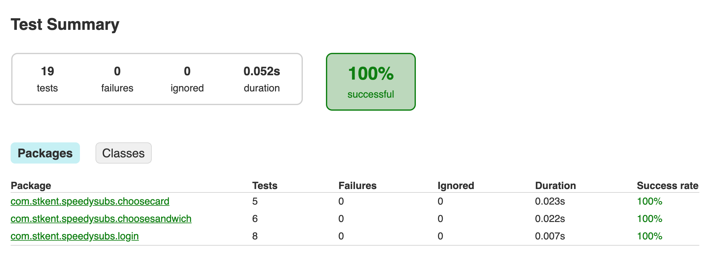

# Before we begin...

- Run the app and spend 15 minutes exploring its functionality and looking through the codebase.

Now let's apply the recipe from the slides, screen-by-screen.

# Login

## Step 1. Create ideal protocols

We'll perform this recipe step in two parts:

**Identify hard-coded dependencies**

- In the `LoginViewModel` class: comparing our code to examples of hard-coded dependencies from the slides, we find the following hard-coded dependencies:
    - `OrderingAPI` (via a call to `OrderingAPI()`).
    - `Session` (via calls to `Session.shared`).

**Create protocols**

- In the `SpeedySubs/Source/Ordering` group: create a protocol named `IOrderingAPI`:
    ```swift
    protocol IOrderingAPI {
        func logIn(username: String,
                   password: String,
                   completionHandler: @escaping (Result<Customer, NetworkingError>) -> ())

        func getCustomerCreditCards(completionHandler: @escaping (Result<[CreditCard], NetworkingError>) -> ())

        func getSandwiches(completionHandler: @escaping (Result<[Sandwich], NetworkingError>) -> ())

        func placeOrder(customer: Customer,
                        order: Order,
                        completionHandler: @escaping (Result<OrderID, NetworkingError>) -> ())
    }
    ```

    Here we choose to include all public `OrderingAPI` methods in the new protocol, rather than just the method called by `LoginViewModel` (`OrderingAPI::logIn`). This decision represents us choosing to prioritize cohesion over specificity. Note too that we authored the `OrderingAPI` type, so its naming conventions are already domain-appropriate. We will see the benefit of prioritizing cohesion when refactoring the next two screens, where we will be able to reuse the cohesive `IOrderingAPI` protocol as-is.

- In the `SpeedySubs/Source/State` group: create a protocol named `ISession`:
    ```swift
    protocol ISession {
        var customer: Customer? { get set }
        var order: Order? { get set }
    }
    ```

    Again, we choose to include all public `Session` properties in this protocol to maintain high cohesion and in anticipation of future uses.

## Step 2: Add initializer parameters

- In the `LoginViewModel` class: add new private properties of types `IOrderingAPI` and `ISession` and populate them in an initializer:
    ```swift
    private let orderingAPI: IOrderingAPI
    private var session: ISession

    init(orderingAPI: IOrderingAPI, session: ISession) {
        self.orderingAPI = orderingAPI
        self.session = session
    }
    ```

## Step 3: Use injected instances

- In the `LoginViewModel` class:
    - Replace all occurrences of `OrderingAPI()` with `orderingAPI`.
    - Replace all occurrences of `Session.shared` with `self.session`.

## Step 4: Create real implementations

- In the `OrderingAPI` class: add conformance to the `IOrderingAPI` protocol (you shouldn't need to add any new methods to do so).
    ```swift
    extension OrderingAPI: IOrderingAPI {}
    ```

- In the `Session` class: add conformance to the `ISession` protocol (you shouldn't need to add any new methods to do so).
    ```swift
    extension Session: ISession {}
    ```

## Step 5: Pass real implementations in production

- In the `LoginViewController` class: fix the error in the line `let viewModel = LoginViewModel()` by injecting the production versions of our newly-declared dependencies:
    ```swift
    let viewModel = LoginViewModel(orderingAPI: OrderingAPI(), session: Session.shared)
    ```

## Step 6: Pass mock implementations in tests

Inspect the pre-written tests in the `LoginViewModelTest` class. You should not see any errors (if you do, double-check that you performed all previous steps accurately.)

The structure of each test is roughly as follows:
- Create mock implementations of any dependency protocols we need to create a `LoginViewModel` instance.
- Create a real `LoginViewModel` instance using those mock implementations.
- Configure the mock implementations with the responses required for the current test scenario.
- Call the public `LoginViewModel` method whose behavior we are currently testing.
- Check that the correct mock implementation methods were called the expected number of times with the expected arguments.

Since this is a class on DI, rather than unit testing, I won't say any more about the test details. But notice how detailed and granular we are able to make these tests, and how clearly each scenario is defined and exercised. This is one major benefit of DI!

## Check your work

Run the app. You should see no behavioral changes!

# Choose Sandwich

## Step 1. Create ideal protocols

**Identify hard-coded dependencies**

- In the `ChooseSandwichViewModel` class: comparing our code to examples of hard-coded dependencies from the slides, we find the following hard-coded dependencies:
    - `OrderingAPI` (via a call to `OrderingAPI()`).
    - `Session` (via a call to `Session.shared`).
    - `UserDefaults` (via calls to `UserDefaults.standard`).

    We have already created an `IOrderingAPI` protocol describing ordering-related behaviors and an `ISession` protocol describing session-related behaviors. Our dependency on `UserDefaults` is new and we must make a new protocol to describe the behaviors it is facilitating.
    
    We did not author the `UserDefaults` type, so its public API is much larger and much less domain-specific than our other concrete dependency implementations. This is a good opportunity to define our own ideal API instead, and hide all the unneeded complexity of the `UserDefaults` API from our consumers.

    `ChooseSandwichViewModel` uses `UserDefaults` for two things: saving the id of the favorite sandwich, and retrieving the id of the saved favorite sandwich. The protocol we define in the next step will include an appropriately-named property whose getter and setter together represent these behaviors.

**Create protocols describing (new) dependency behaviors**

- Make a new `Persistence` group inside the `SpeedySubs/Source` group.

- In the `SpeedySubs/Source/Persistence` group: create a protocol named `IFaveStorage`:
    ```swift
    protocol IFaveStorage {
        var favoriteSandwichId: Int? { get set }
    }
    ```

    This protocol is much smaller than the public API of `UserDefaults` and uses domain-specific naming (vs the domain-agnostic naming of `UserDefaults`). Both are wins when it comes to understanding and testing our code.

## Step 2: Add initializer parameters

- In the `ChooseSandwichViewModel` class: add new private properties of types `IOrderingAPI`, `ISession`, and `IFaveStorage`, and populate them in an initializer:
    ```swift
    private let orderingAPI: IOrderingAPI
    private var session: ISession
    private var faveStorage: IFaveStorage

    init(orderingAPI: IOrderingAPI, session: ISession, faveStorage: IFaveStorage) {
        self.orderingAPI = orderingAPI
        self.session = session
        self.faveStorage = faveStorage
    }
    ```

## Step 3: Use injected instances

- In the `ChooseSandwichViewModel` class:
    - Replace all occurrences of `OrderingAPI()` with `orderingAPI`.
    - Replace all occurrences of `Session.shared` with `session`.
    - Replace the line `UserDefaults.standard.set(sandwich.id, forKey: ChooseSandwichViewModel.faveIDKey)` with `faveStorage.favoriteSandwichId = sandwich.id`.
    - Replace `UserDefaults.standard.value(forKey: ChooseSandwichViewModel.faveIDKey) as? Int` with `faveStorage.favoriteSandwichId`.
    - Delete the now-unused constant `faveIDKey`.

## Step 4: Create real implementations

- In the `SpeedySubs/Source/Persistence` group: create a class named `UserDefaultsFaveStorage` that implements `IFaveStorage` using the standard `UserDefaults` instance:
    ```swift
    import Foundation

    class UserDefaultsFaveStorage: IFaveStorage {

        private static let faveIDKey = "FAVE_ID"

        var favoriteSandwichId: Int? {
            get {
                return UserDefaults.standard.value(forKey: UserDefaultsFaveStorage.faveIDKey) as? Int
            }
            set(newId) {
                UserDefaults.standard.set(newId, forKey: UserDefaultsFaveStorage.faveIDKey)
            }
        }
    }
    ```

## Step 5: Pass real implementations in production

- In the `ChooseSandwichViewController` class: fix the error in the line `let viewModel = ChooseSandwichViewModel()` by injecting the newly-required dependencies:
    ```swift
    let viewModel = ChooseSandwichViewModel(orderingAPI: OrderingAPI(),
                                            session: Session.shared,
                                            faveStorage: UserDefaultsFaveStorage())
    ```

## Step 6: Pass mock implementations in tests

Inspect the pre-written tests in the `ChooseSandwichViewModelTest` class. These all use the same structure as the tests in the `LoginViewModelTest` class.

## Check your work

Run the app. You should see no behavioral changes!

# Wrap Up

Run all the tests. Everything should pass (and be super-fast)!



# Back to the slides...

Time to head back to the part1-slides directory and read the final few slides!
